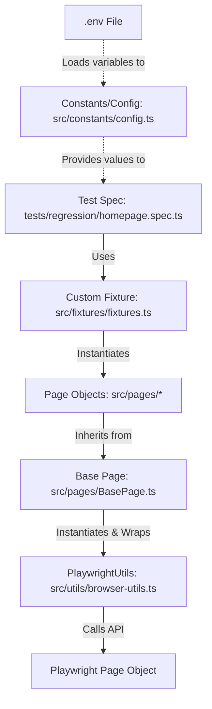

# Enterprise Playwright Automation Framework: Interview Guide

This guide is designed to help you explain the architecture, design choices, and flow of your Playwright automation framework in a technical interview context.

---

## 📐 Framework Architecture & Flow

The framework is built using **TypeScript**, **Playwright Test Runner**, and the **Page Object Model (POM)** pattern enhanced with **custom fixtures**.

### Architecture Diagram

---

## 🗂️ Folder Structure & Responsibilities

| Directory/File | Responsibility | Why it exists (Interview Point) |
| :--- | :--- | :--- |
| **`tests/`** | Contains spec files structured by suites (`smoke/`, `regression/`). | Keeps test suites separated logically for target run plans (e.g., CI/CD triggers). |
| **`src/pages/`** | Locators and page-specific actions (e.g., `BasePage`, `HomePage`). | Decouples tests from UI element selectors. If a button's selector changes, you update it once in the Page Object. |
| **`src/fixtures/`** | Overrides/extends base Playwright fixtures. | Implements **Dependency Injection**. It handles the instantiation and teardown of Page Objects. |
| **`src/utils/`** | Shared browser action helpers (`browser-utils.ts`). | Centralizes error handling, logging, waits, and assertions to keep pages thin and readable. |
| **`src/constants/`** | Config constants (`config.ts`). | Keeps configuration separate from code. Removes magic strings and hardcoded timeouts. |
| **`.env`** | Local environment variables. | Facilitates running tests against different environments (e.g., Dev, QA, Staging) without modifying code. |
| **`playwright.config.ts`** | Global Playwright configuration. | Central configuration for runners, reporters (HTML), retry policies, and screenshot capturing on failure. |
| **`tsconfig.json`** | TypeScript settings and Path Aliases. | Implements module path mapping (e.g., `@pages/*`) to avoid brittle relative imports. |

---

## 💡 Key Design Decisions & Why We Made Them

### 1. Page Object Model (POM) with Class Inheritance
* **What**: We have a `BasePage` that holds the page object and an instance of our `PlaywrightUtils`. Other pages (e.g., `HomePage`) extend `BasePage`.
* **Why**: Avoids code duplication. If every page needs access to utility wrappers or navigation, they inherit it naturally from `BasePage` through `super(page)`.

### 2. Custom Fixtures (Dependency Injection)
* **What**: Rather than writing `const homePage = new HomePage(page)` inside every test block, we register pages as fixtures in `fixtures.ts`.
* **Why**: 
  1. **Cleanliness**: Tests only request the page objects they need as arguments: `test('validate title', async ({ homePage }) => { ... })`.
  2. **Lifecycle Management**: Playwright automatically instantiates and cleans up the browser context and page object behind the scenes, reducing boilerplate code.

### 3. Utility Wrappers (`PlaywrightUtils`)
* **What**: A helper class that wraps Playwright's native actions (e.g., `click()`, `fill()`, `waitForSelector()`).
* **Why**: 
  1. **Resiliency**: We can add automatic retry logic, custom timeouts, or automatic waiting rules in one single place.
  2. **Traceability**: We can add centralized logging (e.g., console logs or reporting annotations) inside `PlaywrightUtils` so every action is documented automatically in execution reports.

### 4. TypeScript Path Aliasing
* **What**: Instead of importing files using relative directories (e.g., `../../src/pages/HomePage`), we use aliases (e.g., `@pages/HomePage`).
* **Why**: Prevents "relative import hell" and makes the codebase easier to refactor. If you move a test script to a different directory, the imports don't break.

---

## 💬 Practice Interview Q&A

### Q1: "Explain your framework (Walk me through the high-level architecture)."
> **Answer**: 
> "It's an enterprise-ready, modular test automation framework built using **TypeScript** and **Playwright**.
> 
> The architecture is structured into three main layers to guarantee scalability and maintainability:
> 1. **Page Object Model (POM) with Class Inheritance**: We use a `BasePage` that encapsulates the standard Playwright `page` instance and instantiates a `PlaywrightUtils` utility class. All individual pages (e.g., `HomePage`) inherit from `BasePage`. This prevents locator/action duplication and keeps code DRY.
> 2. **Dependency Injection via Custom Fixtures**: Instead of manually instantiating page objects inside test files using `new`, we extend Playwright's base test block with custom page fixtures. Pages are initialized lazily and injected directly into test functions.
> 3. **Resilient Wrapper Layer (`PlaywrightUtils`)**: Element interactions (clicks, inputs, waits, and assertions) are routed through a robust wrapper class. This allows us to handle retries, waits, and logging in one centralized place.
> 
> To support different testing environments, we use **dotenv** for dynamic configuration, and we implement **tsconfig path aliases** to keep our imports clean and prevent refactoring breaks."

### Q2: "Why did you implement custom fixtures instead of instantiating Page Objects inside the test files?"
> **Answer**:
> "Using custom fixtures separates page instantiation from test logic. In standard POM frameworks, test files are cluttered with setups like `const homePage = new HomePage(page)`. 
> With Playwright fixtures:
> - We instantiate pages lazily (only when a test requests them).
> - Tests remain highly readable because dependencies are passed directly into the test parameters.
> - Page teardowns and context setups are handled globally, making execution lifecycle management centralized and automated."

### Q3: "How does your framework handle environment-specific configurations?"
> **Answer**:
> "We use `dotenv` to load environment configurations. In the root, we maintain a `.env` file (with a `.env.example` template committed to version control). 
> The `playwright.config.ts` initializes `dotenv.config()` at runtime. Then, our central `config.ts` loads those variables dynamically (e.g., `process.env.BASE_URL`) while providing safe fallback URLs. This allows us to switch environments on the fly in CI/CD pipelines simply by injecting environment variables."

### Q4: "Can you walk me through the execution flow of a test in this framework?"
> **Answer**:
> "When we trigger a run using a command like `npm run test`:
> 1. **Configuration Loading**: Playwright reads `playwright.config.ts`, triggers `dotenv.config()` to load environment variables into `process.env`, and reads execution parameters (like browser config and HTML reporters).
> 2. **Fixture Setup**: Playwright identifies the spec files, initializes the browser context, and activates our custom fixture file (`fixtures.ts`).
> 3. **Page Injection**: The fixture creates instances of requested Page Objects (injecting the browser's `page` instance) and provides them to the test spec parameter block.
> 4. **Execution**: The test executes page action methods. These page actions call inherited functions from `BasePage` which delegate to `PlaywrightUtils` for resilient browser actions.
> 5. **Tear down & Report**: Playwright takes screenshots or videos if configured (e.g., on failure), closes the context, and generates the final HTML test report in `reports/html/`."
